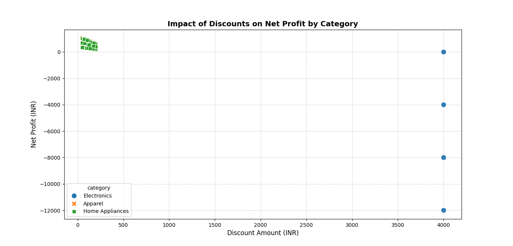

# Retail Revenue Leakage & Profit Intelligence

An end-to-end data engineering and profit intelligence solution designed to audit, capture, and analyze financial revenue leakage, margin erosions, and the operational risks of stacked promotional strategies in a retail business model.

---

## Project Overview

In complex retail environments, revenue leakage frequently occurs due to aggressive markdowns, uncontrolled coupon stacking, and product returns. This project implements a high-performance **Star Schema Data Warehouse** in MySQL, automates transactional data simulation using Python, executes diagnostic auditing queries, and visualizes how unoptimized discount frameworks impact bottom-line net profits.

---

## Repository Structure

The project files are structured sequentially to reflect a clean data engineering and analytics workflow:

| File Name | File Type | Description |
| :--- | :--- | :--- |
| `01_retail_profit_intelligence_schema.sql` | SQL Script | Database initialization and Star Schema architecture layout (Fact & Dimension tables). |
| `02_revenue_leakage.sql` | SQL Script | Analytical queries calculating theoretical gross vs. actual net profit and leakage ranking by location[cite: 2]. |
| `03_audit_promotions.sql` | SQL Script | Compliance and operational audit script built to flag high-risk stacked promotion transactions[cite: 3]. |
| `04_data_loader.py` | Python Script | Synthetic data generator and ETL pipeline that safely populates dimensions and loads ~300 mock transactions. |
| `05_eda_insights.py` | Python Script | Exploratory Data Analysis script utilizing SQLAlchemy to pull operational logs and generate diagnostic charts. |
| `Retail-Revenue-Leakage-Profit-Intelligence-dashboard.png` | Visualization | Matplotlib output chart illustrating the devastating impact of unmonitored discounts on category net profits. |

---

## Architecture & Data Model

The analytical database architecture leverages an optimized **Star Schema** to ensure fast query processing for retail business intelligence:

* **Fact Table:** 
  * `fact_sales`: Tracks granular transactional metrics including quantities, selling prices, absolute discount amounts, coupon allocations, return statuses, and derived net profits[cite: 1].
* **Dimension Tables:**
  * `dim_customer`: Captures customer demographics, geography, and membership tier segments[cite: 1].
  * `dim_product`: Houses product metadata, category verticals, brand mapping, and exact cost prices[cite: 1].
  * `dim_store`: Maps out physical and regional retail nodes/locations[cite: 1].
  * `dim_date`: Time-series mapping key for temporal sales intelligence[cite: 1].

---

## Core Analytical Features

### 1. Financial Revenue Leakage Mapping (`02_revenue_leakage.sql`)
The core pipeline evaluates financial slippage by contrasting **Theoretical Gross Revenue** against **Actual Net Profit**[cite: 2]. It applies window functions (`DENSE_RANK()`) to pinpoint which regional store nodes suffer the highest leakage concentrations per product category[cite: 2].

### 2. Promotional Risk & Compliance Auditing (`03_audit_promotions.sql`)
Triggers a high-priority operational alert (`ALERT: Stacked Promotion`) whenever a transaction combines both an upfront commercial discount and an additional active coupon code[cite: 3]. This catches business logic loopholes before margins completely erode[cite: 3].

### 3. Visual Margin Insights (`Retail-Revenue-Leakage-Profit-Intelligence-dashboard.png`)
Generated directly via `05_eda_insights.py`, the scatter plot highlights a massive operational risk: while categories like *Apparel* and *Home Appliances* maintain steady profitability with controlled discounts, the *Electronics* sector takes significant net losses (dipping past -12,000 INR) due to overlapping stacked promotional parameters[cite: 4, 5].


---

## Implementation & Execution Guide

### Prerequisites
Ensure your local system has a working MySQL Server instance and Python 3.x installed with the following libraries:
```bash
pip install mysql-connector-python pandas matplotlib seaborn sqlalchemy


Steps to Run

### 1)Initialize Warehouse Schema: 
          Execute the schema definition script inside your MySQL client[cite: 1].

```SQL
   SOURCE 01_retail_profit_intelligence_schema.sql;
   
 
### 2)Execute ETL Data Simulation:
        Run the Python data pipeline to establish dimension lookups and generate synthetic transaction entries[cite: 4].

```Bash
   python 04_data_loader.py
  
  
### I) Run Audit Queries: 
        Execute 02_revenue_leakage.sql and 03_audit_promotions.sql to identify revenue leakage anomalies and pull transactional alert reports.
		
### II) Generate Analytics Visuals: 
        Run the exploratory script to refresh data insights and output the dashboard visualization chart[cite: 5].
		
``` Bash
   python 05_eda_insights.py
